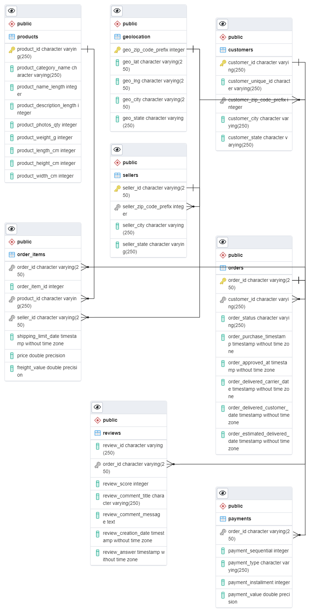
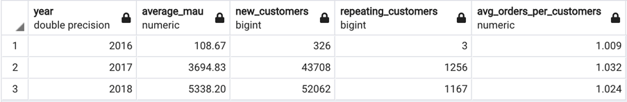
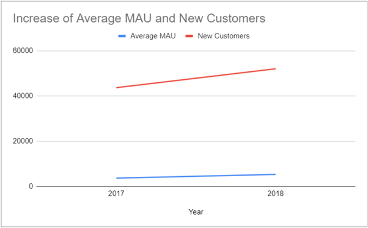
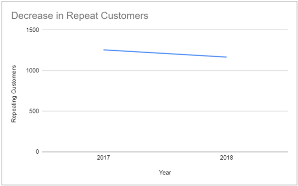
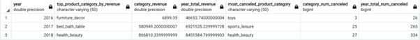
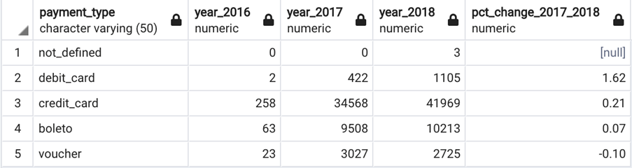
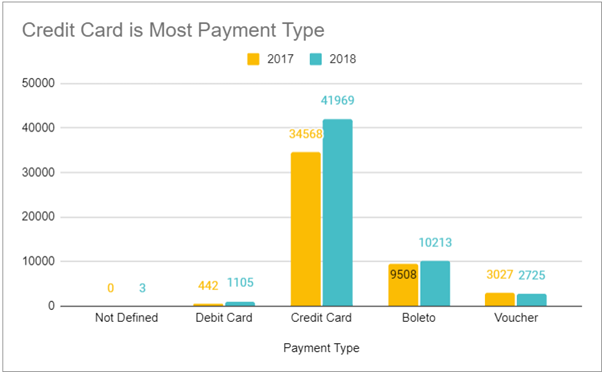

# Analyzing eCommerce Business Performance with SQL

## Deskripsi Project
<p align= "justify">
Pada project ini, saya berperan sebagai anggota tim **Data Analytics** di sebuah perusahaan eCommerce besar di Amerika Selatan.  
Perusahaan ini merupakan salah satu marketplace terbesar di wilayah tersebut, menghubungkan pelaku usaha mikro dengan jutaan pelanggan.  
Tugas saya adalah menganalisis **tiga aspek kunci performa bisnis** untuk membantu manajemen mengambil keputusan strategis.
</p>

Ketiga aspek yang saya analisis adalah:
1. **Pertumbuhan Pelanggan**
2. **Kualitas Produk**
3. **Tipe Pembayaran**

Analisis ini dilakukan menggunakan **SQL** dengan memanfaatkan 9 dataset yang sudah disediakan dalam format CSV.

---

## Dataset
Berikut adalah penjelasan detail setiap dataset:

| Dataset        | Deskripsi |
|----------------|-----------|
| `customers_dataset.csv`  | Informasi pelanggan, termasuk ID pelanggan dan lokasi. |
| `geolocation_dataset` | Data koordinat geografis (latitude, longitude) yang dikaitkan dengan kode pos. |
| `order_items_dataset.csv` | Detail barang pada setiap pesanan, termasuk harga, biaya pengiriman, dan ID produk. |
| `order_payments_dataset` | Data transaksi pembayaran, termasuk metode pembayaran, nilai pembayaran, dan jumlah cicilan. |
| `order_reviews_dataset` | Ulasan pelanggan, termasuk rating dan komentar. |
| `orders_dataset.csv` | Data pesanan pelanggan, termasuk tanggal pembelian, status, dan waktu pengiriman. |
| `product_dataset.csv` | Informasi produk, termasuk kategori, ukuran, dan detail lainnya. |
| `sellers_dataset` | Informasi penjual, termasuk ID penjual dan lokasi. |

---

## Tujuan Analisis

### 1. **Annual Customer Activity Growth Analysis**
**Tujuan:**
- Mengukur pertumbuhan jumlah pelanggan aktif setiap tahun.
- Mengidentifikasi tren perilaku pelanggan dari waktu ke waktu.
- Memberikan insight apakah strategi marketing dan retensi pelanggan berjalan efektif.

---

### 2️. **Annual Product Category Quality Analysis**
**Tujuan:**
- Mengukur kualitas produk berdasarkan rating ulasan pelanggan.
- Mengidentifikasi kategori produk dengan kualitas terbaik dan terburuk.
- Mengetahui apakah ada penurunan kualitas pada kategori tertentu dari tahun ke tahun.

---

### 3️. **Analysis of Annual Payment Type Usage**
**Tujuan:**
- Menganalisis tren penggunaan metode pembayaran setiap tahun.
- Mengidentifikasi metode pembayaran yang paling populer dan yang mulai jarang digunakan.
- Mengetahui apakah preferensi pembayaran berubah dari waktu ke waktu.

---

## Proses Pengerjaan
### 1. **Data Preparation**
   - Membuat workspace database.
```sql
	CREATE TABLE customers (
	    customer_id VARCHAR(250),
	    customer_unique_id VARCHAR(250),
	    customer_zip_code_prefix INT,
	    customer_city VARCHAR(250),
	    customer_state VARCHAR(250)
    );

    CREATE TABLE geolocation (
	    geo_zip_code_prefix VARCHAR(250),
	    geo_lat VARCHAR(250),
	    geo_lng VARCHAR(250),
	    geo_city VARCHAR(250),
	    geo_state VARCHAR(250)
    );
 
    CREATE TABLE order_item (
	    order_id VARCHAR(250),
	    order_item_id INT,
	    product_id VARCHAR(250),
	    seller_id VARCHAR(250),
	    shipping_limit_date TIMESTAMP,
	    price FLOAT,
	    freight_value FLOAT
    );

    CREATE TABLE payments (
	    order_id VARCHAR(250),
	    payment_sequential INT,
	    payment_type VARCHAR(250),
	    payment_installment INT,
	    payment_value FLOAT
    );

    CREATE TABLE reviews (
	    review_id VARCHAR(250),
	    order_id VARCHAR(250),
	    review_score INT, 
	    review_comment_title VARCHAR(250),
	    review_comment_message TEXT,
	    review_creation_date TIMESTAMP,
	    review_answer TIMESTAMP
    );

    CREATE TABLE orders (
	    order_id VARCHAR(250),
	    customers_id VARCHAR(250),
	    order_status VARCHAR(250),
	    order_purchase_timestamp TIMESTAMP,
	    order_approved_at TIMESTAMP,
	    order_delivered_carrier_date TIMESTAMP,
	    order_delivered_customer_date TIMESTAMP,
	    order_estimated_delivered_date TIMESTAMP
    );

    CREATE TABLE products (
	    product_id VARCHAR(250),
	    product_category_name VARCHAR(250),
	    product_name_length INT,
	    product_description_length INT,
	    product_photos_qty INT,
	    product_weight_g INT,
	    product_length_cm INT,
	    product_height_cm INT,
	    product_width_cm INT
    );

    CREATE TABLE sellers (
	    seller_id VARCHAR(250),
	    seller_zip_code INT,
	    seller_city VARCHAR(250),
    	seller_state VARCHAR(250)
    );
```
 
   - Mengimpor semua dataset CSV ke dalam database.

```sql
	COPY customers (
         customer_id,
         customer_unique_id,
     	 customer_zip_code_prefix,
     	 customer_city,
     	 customer_state
   	)
   	FROM 'C:\Users\denindra\Documents\Project\SQL\Dataset\customers_dataset.csv'
   	DELIMITER ','
   	CSV HEADER;

   	COPY geolocation (
	     geo_zip_code_prefix,
	     geo_lat,
	     geo_lng,
	     geo_city,
	     geo_state
   	)
   	FROM 'C:\Users\denindra\Documents\Project\SQL\Dataset\geolocation_dataset.csv'
   	DELIMITER ','
   	CSV HEADER;

   	COPY order_item (
	     order_id,
	     order_item_id,
	     product_id,
	     seller_id,
	     shipping_limit_date,
	     price,
	     freight_value
   	)
   	FROM 'C:\Users\denindra\Documents\Project\SQL\Dataset\order_items_dataset.csv'
   	DELIMITER ','
   	CSV HEADER;

   	COPY payments (
	     order_id,
	     payment_sequential,
	     payment_type,
	     payment_installment,
	     payment_value
   	)
   	FROM 'C:\Users\denindra\Documents\Project\SQL\Datasetorder_payments_dataset.csv'
   	DELIMITER ','
   	CSV HEADER;

   	COPY reviews (
	     review_id,
	     order_id,
	     review_score, 
	     review_comment_title,
	     review_comment_message,
	     review_creation_date,
	     review_answer
   	)
   	FROM 'C:\Users\denindra\Documents\Project\SQL\Dataset\order_reviews_dataset.csv'
   	DELIMITER ','
   	CSV HEADER;

   	COPY orders (
	     order_id,
	     customers_id,
	     order_status,
	     order_purchase_timestamp,
	     order_approved_at,
	     order_delivered_carrier_date,
	     order_delivered_customer_date,
	     order_estimated_delivered_date
   	)
   	FROM 'C:\Users\denindra\Documents\Project\SQL\Dataset\orders_dataset.csv'
   	DELIMITER ','
   	CSV HEADER;

   	COPY products (
	     product_id,
	     product_category_name,
	     product_name_length,
	     product_description_length,
	     product_photos_qty,
	     product_weight_g,
	     product_length_cm,
	     product_height_cm,
	     product_width_cm
   	)
   	FROM 'C:\Users\denindra\Documents\Project\SQL\Dataset\product_dataset.csv'
   	DELIMITER ','
  	CSV HEADER;

  	COPY sellers (
	     seller_id,
	     seller_zip_code,
	     seller_city,
       	 seller_state
    )
   	FROM 'C:\Users\denindra\Documents\Project\SQL\Dataset\sellers_dataset.csv'
    DELIMITER ','
    CSV HEADER;
```
	
   - Membuat **Entity Relationship Diagram (ERD)** untuk memahami hubungan antar tabel.

```sql
    ## Primary Key
    ALTER TABLE products ADD CONSTRAINT pk_products PRIMARY KEY (product_id);
    ALTER TABLE order_items ADD FOREIGN KEY (product_id) REFERENCES products;
    ALTER TABLE customers ADD CONSTRAINT pk_cust PRIMARY KEY (customer_id);
    ALTER TABLE geolocation ADD CONSTRAINT pk_geo PRIMARY KEY (geo_zip_code_prefix);
    ALTER TABLE orders ADD CONSTRAINT pk_orders PRIMARY KEY (order_id);
    ALTER TABLE sellers ADD CONSTRAINT pk_seller PRIMARY KEY (seller_id);

    ## Foreign Key
    ALTER TABLE customers ADD FOREIGN KEY (customer_zip_code_prefix) REFERENCES geolocation;
    ALTER TABLE orders ADD FOREIGN KEY (customer_id) REFERENCES customers;
    ALTER TABLE order_items ADD FOREIGN KEY (order_id) REFERENCES orders;
    ALTER TABLE order_items ADD FOREIGN KEY (seller_id) REFERENCES sellers;
    ALTER TABLE sellers ADD FOREIGN KEY (seller_zip_code_prefix) REFERENCES geolocation;
    ALTER TABLE payments ADD FOREIGN KEY (order_id) REFERENCES orders;
    ALTER TABLE order_items ADD FOREIGN KEY (product_id) REFERENCES products;
    ALTER TABLE reviews ADD FOREIGN KEY (order_id) REFERENCES orders;
```
	
 

### 2. SQL Query Development
#### 2.1. Annual Customer Activity Growth Analysis
  - Query
```sql
     WITH 
     ## Rata-rata jumlah customer aktif bulanan (monthly active user)
     calc_mau AS (
     SELECT
       year,
       round(AVG(mau), 2) AS average_mau
     FROM (
       SELECT
         date_part('year', o.order_purchase_timestamp) AS year,
         date_part('month', o.order_purchase_timestamp) AS month,
         COUNT(distinct c.customer_unique_id) AS mau
       FROM orders o
       JOIN customers c ON o.customer_id = c.customer_id
       GROUP BY 1,2
       ) subq
     GROUP BY 1
     ),

     ## Jumlah customer baru (pertama kali bertransaksi)
     calc_newcust AS (
     SELECT
       date_part('year', first_purchase_time) AS year,
       COUNT(1) AS new_customers
     FROM (
       SELECT
         c.customer_unique_id,
         min(o.order_purchase_timestamp) AS first_purchase_time
       FROM orders o
       JOIN customers c ON c.customer_id = o.customer_id
       GROUP BY 1
     ) subq
     GROUP BY 1
     ),

     ## Jumlah customer yang melakukan pembelian lebih dari satu kali (repeat order)
     calc_repeat AS (
     SELECT
       year,
       COUNT(distinct customer_unique_id) AS repeating_customers
     FROM (
       SELECT
         date_part('year', o.order_purchase_timestamp) AS year,
         c.customer_unique_id,
         COUNT(1) AS purchase_frequency
       FROM orders o
       JOIN customers c ON c.customer_id = o.customer_id
       GROUP BY 1, 2
       HAVING COUNT(1) > 1
     ) subq
     GROUP BY 1
     ),

     ## Rata-rata jumlah order yang dilakukan customer
     calc_avg_freq AS (
     SELECT
       year,
       ROUND(AVG(frequency_purchase),3) AS avg_orders_per_customers
     FROM (
       SELECT
         date_part('year', o.order_purchase_timestamp) AS year,
         c.customer_unique_id,
         COUNT(1) AS frequency_purchase
       FROM orders o
       JOIN customers c ON c.customer_id = o.customer_id
       GROUP BY 1, 2
     ) a
     GROUP BY 1
     )

     ## Menggabungkan ketiga metrik
     SELECT
       mau.year,
       mau.average_mau,
       newc.new_customers,
       rep.repeating_customers,
       freq.avg_orders_per_customers
     FROM calc_mau mau
     JOIN calc_newcust newc ON mau.year = newc.year
     JOIN calc_repeat rep ON rep.year = mau.year
     JOIN calc_avg_freq freq ON freq.year = mau.year
```
     
  - Result
    
    
    
  - Analysis
    | Visualization | Analysis |
	|-----------------|---------------|
	|  | <p align= "justify"> Data yang tersedia dimulai dari data transaksi pada bulan September 2016 sehingga menyebabkan hasil analisis di tahun 2016 memiliki perbedaan yang jauh dibandingkan dengan nilai di tahun 2017 dan 2018. Dari analisis ini, terlihat bahwa aktivitas pelanggan bulanan (MAU) dan juga jumlah pelanggan baru mengalami peningkatan. </p> |
	|  | <p align= "justify"> Namun di sisi lain, dari segi pemesanan/order yang dilakukan pelanggan terlihat tidak terlalu baik. Terlihat bahwa kebanyakan dari pelanggan hanya melakukan order satu kali sepanjang tahun. Bahkan jumlah pelanggan yang melakukan repeat order mengalami sedikit penurunan dari tahun 2017 ke tahun 2018. </p> |

#### 2.2. Annual Customer Activity Growth Analysis
  - Query
```sql
	## Informasi pendapatan/revenue perusahaan
	CREATE TABLE total_revenue_per_year AS
	SELECT 
		DATE_PART('year', o.order_purchase_timestamp) AS year,
		SUM(revenue_per_order) AS revenue
	FROM (
		SELECT 
			order_id, 
			SUM(price+freight_value) AS revenue_per_order
		FROM order_items
		GROUP BY 1
	) subq
	JOIN orders o ON subq.order_id = o.order_id
	WHERE o.order_status = 'delivered'
	GROUP BY 1;

	## Informasi jumlah cancel order
	CREATE TABLE total_cancel_per_year AS 
	SELECT 
		DATE_PART('year', order_purchase_timestamp) AS year,
		COUNT(1) AS num_canceled_orders
	FROM orders
	WHERE order_status = 'canceled'
	GROUP BY 1;

	## Kategori produk yang memberikan pendapatan total tertinggi
	CREATE TABLE top_product_category_by_revenue_per_year AS 
	SELECT 
		year, 
		product_category_name, 
		revenue 
	FROM (
		SELECT 
			DATE_PART('year', o.order_purchase_timestamp) AS year,
			p.product_category_name,
			SUM(oi.price + oi.freight_value) AS revenue,
			RANK() OVER(PARTITION BY 
		DATE_PART('year', o.order_purchase_timestamp) 
 		ORDER BY 
		SUM(oi.price + oi.freight_value) desc) AS rk
		FROM order_items oi
	JOIN orders o ON o.order_id = oi.order_id
	JOIN products p ON p.product_id = oi.product_id
	WHERE o.order_status = 'delivered'
	GROUP BY 1,2) sq
	WHERE rk = 1;

	## Kategori produk yang memiliki jumlah cancel order terbanyak
	CREATE TABLE most_canceled_product_category_per_year AS 
	SELECT 
		year, 
		product_category_name, 
		num_canceled 
	FROM (
	SELECT 
		DATE_PART('year', o.order_purchase_timestamp) AS year,
		p.product_category_name,
		COUNT(1) AS num_canceled,
		RANK() OVER(PARTITION BY 
		DATE_PART('year', o.order_purchase_timestamp) 
		ORDER BY COUNT(1) desc) AS rk
	FROM order_items oi
	JOIN orders o ON o.order_id = oi.order_id
	JOIN products p ON p.product_id = oi.product_id
	WHERE o.order_status = 'canceled'
	GROUP BY 1,2) sq
	WHERE rk = 1;

	## Menggabungkan informasi-informasi yang telah didapatkan
	SELECT 
		a.year,
		a.product_category_name AS top_product_category_by_revenue,
		a.revenue AS category_revenue,
		b.revenue AS year_total_revenue,
		c.product_category_name AS most_canceled_product_category,
		c.num_canceled AS category_num_canceled,
		d.num_canceled_orders AS year_total_num_canceled
	FROM top_product_category_by_revenue_per_year a
	JOIN total_revenue_per_year b ON a.year = b.year 
	JOIN most_canceled_product_category_per_year c ON a.year = c.year 
	JOIN total_cancel_per_year d ON d.year = a.year;
```
  - Result
    
    
    
  - Analysis
<p align= "justify">
    Dari analisis ini, terlihat bahwa kategori produk yang memberikan revenue terbanyak setiap tahunnya mengalami perubahan. Dilihat dari sisi revenue perusahaan secara keseluruhan juga mengalami peningkatan setiap tahunnya. Untuk kategori produk yang mengalami cancel terbanyak juga mengalami perubahan setiap tahunnya. Hal yang menarik untuk diperhatikan di sini adalah kategori produk health & beauty merupakan kategori produk yang memberikan revenue terbanyak sekaligus kategori produk yang mengalami cancel terbanyak di tahun 2018. 
Hal ini mungkin terjadi karena pada tahun 2018 memang kategori produk yang mendominasi keseluruhan transaksi adalah health & beauty. Analisis lebih lanjut dapat dilakukan untuk mengkonfirmasi hal ini.
</p>

#### 2.3. Analysis of Annual Payment Type Usage
  - Query
```sql
	WITH 
	tmp AS (
	SELECT 
		DATE_PART('year', o.order_purchase_timestamp) AS year,
		op.payment_type,
		COUNT(1) AS num_used
	FROM order_payments op 
	JOIN orders o ON o.order_id = op.order_id
	GROUP BY 1, 2
	) 

	SELECT *,
		CASE WHEN year_2017 = 0 then NULL
			 ELSE round((year_2018 - year_2017) / year_2017, 2)
			 END AS pct_change_2017_2018
		FROM (
			SELECT 
  				payment_type,
				SUM(CASE WHEN year = '2016' then num_used ELSE 0 end) AS year_2016,
  				SUM(CASE WHEN year = '2017' then num_used ELSE 0 end) AS year_2017,
  				SUM(CASE WHEN year = '2018' then num_used ELSE 0 end) AS year_2018
			FROM tmp 
			GROUP BY 1) subq
		ORDER BY 5 DESC;
```
  - Result
    
    
    
  - Analysis
    
    
<p align= "justify">
	Secara keseluruhan, metode pembayaran yang lebih diminati adalah kartu kredit, sehingga dapat dilakukan analisis lebih lanjut mengenai kebiasaan pelanggan dalam menggunakan kartu kredit, misalnya seperti lama tenor yang dipilih, kategori produk apa yang biasa dibeli dengan kartu kredit, dsb. 
Hal lain yang menarik untuk diperhatikan di sini adalah peningkatan penggunaan kartu debit yang signifikan, yaitu lebih dari 100% dari tahun 2017 ke tahun 2018. Di sisi lain, penggunaan voucher justru menurun dari tahun 2017 ke tahun 2018. 
Hal ini mungkin terjadi karena adanya promosi/kerja sama dengan kartu debit tertentu dan juga pengurangan metode promosi menggunakan voucher. Analisis lebih lanjut dapat dilakukan dengan melakukan konfirmasi dengan departemen lain, misalnya Marketing atau Business Development terkait hal ini.
</p>


